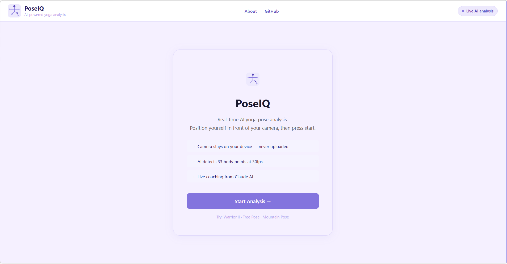
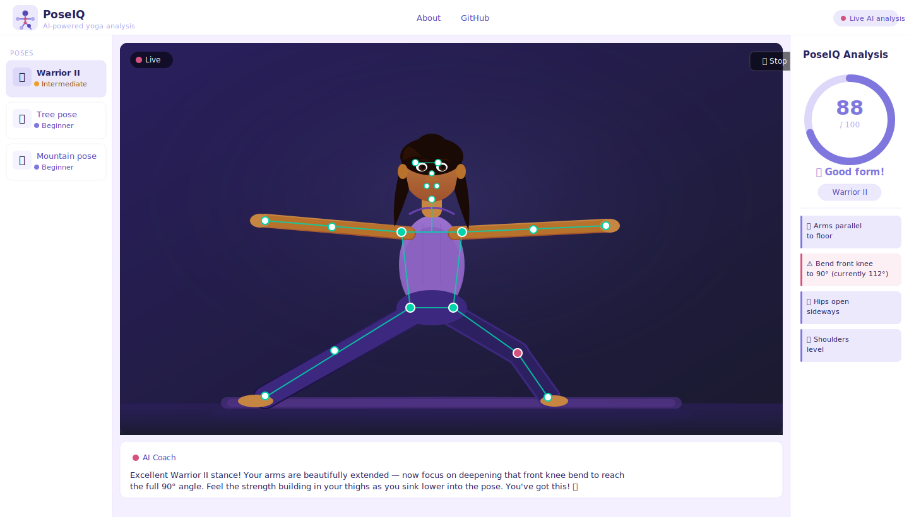

<div align="center">
  
  
  # PoseIQ
  
  **Real-time AI yoga pose analyzer — runs entirely in your browser**
  
  [](https://poseiq-riddhi.vercel.app)
  [](https://react.dev)
  [](https://typescriptlang.org)
  [](https://mediapipe-studio.webapps.google.com)
  
</div>

---

## What is PoseIQ?

PoseIQ uses your webcam and Google's MediaPipe AI to analyze your yoga poses in real time — giving you a live accuracy score, joint-by-joint corrections, and AI coaching from Claude. No app download. No data sent to any server. Everything runs privately in your browser.

> 🚧 **Actively in development** — hold timer, score history, and more poses coming next.

---

## Demo

> 📸 *Screenshot — Warrior II analysis with live AI coaching*

| Start screen | Live analysis |
|---|---|
|  |  |

---

## Features

- **Real-time pose detection** — MediaPipe tracks 33 body keypoints at 30fps directly in the browser
- **Live accuracy score** — 0–100 score updates every frame based on joint angle thresholds
- **Joint-by-joint feedback** — specific corrections like "bend your front knee to 90°"
- **AI coaching overlay** — Claude streams personalized coaching tips based on your live pose data
- **3 poses supported** — Warrior II, Tree Pose, Mountain Pose (expanding)
- **Privacy first** — all AI inference runs client-side via WebAssembly + GPU, zero data leaves your device
- **Responsive** — works on desktop and mobile

---

## Supported Poses

| Pose | Level | Key Checks |
|------|-------|-----------|
| 🥋 Warrior II | Intermediate | Front knee 90°, arms parallel to floor, hips open sideways |
| 🌳 Tree Pose | Beginner | Standing leg straight, raised knee bent outward, arms overhead |
| ⛰️ Mountain Pose | Beginner | Both legs straight, shoulders level, arms relaxed at sides |

---

## How It Works

```
Webcam frame
    ↓
MediaPipe Pose Landmarker (WebAssembly + GPU)
    ↓
33 body landmark coordinates (x, y, z) at 30fps
    ↓
Joint angle calculations (hip→knee→ankle, shoulder→elbow→wrist)
    ↓
Pose rules engine — compare angles to ideal thresholds
    ↓
Live score (0–100) + corrections
    ↓
Every 15s → Claude API → streamed coaching text
```

**What makes this technically interesting:**
- All pose inference runs in WebAssembly on the GPU — no backend needed for AI
- The Claude coaching layer is throttled (max 20 calls/session, 15s interval) to prevent API abuse
- Pose definitions are pure functions — `(landmarks) => PoseFeedback` — making new poses trivial to add
- `useRef` animation loop synced to video frame timestamps for accurate per-frame detection

---

## Tech Stack

| Layer | Technology |
|-------|-----------|
| Frontend | React 18 + TypeScript |
| AI / Pose Detection | MediaPipe Pose Landmarker (Google) |
| AI Coaching | Anthropic Claude API (streaming) |
| Build tool | Vite |
| Styling | CSS-in-JS with centralized theme |
| Deployment | Vercel (auto-deploy on push) |

---

## Project Structure

```
src/
├── components/
│   ├── Camera.tsx          # Webcam feed + canvas skeleton overlay
│   ├── FeedbackPanel.tsx   # Live score ring + joint feedback UI
│   ├── PoseSidebar.tsx     # Pose selector (desktop)
│   ├── AICoach.tsx         # Streaming Claude coaching panel
│   ├── Header.tsx          # App header + navigation
│   ├── AboutModal.tsx      # About modal overlay
│   └── Logo.tsx            # SVG logo component
├── hooks/
│   ├── useMediaPipe.ts     # MediaPipe init, animation loop, cleanup
│   └── useCoachThrottle.ts # Rate limiting for Claude API calls
├── poses/
│   ├── index.ts            # Pose registry + PoseDefinition interface
│   ├── warrior2.ts         # Warrior II angle analysis
│   ├── tree.ts             # Tree Pose analysis
│   └── mountain.ts         # Mountain Pose analysis
├── utils/
│   └── angles.ts           # Joint angle calculation (3-point vector math)
├── theme.ts                # Centralized Lavender & Rose color palette
└── main.tsx
api/
└── coach.ts                # Vercel serverless function — Claude API proxy
```

---

## Getting Started

### Prerequisites
- Node.js 18+
- A webcam
- Chrome recommended (best GPU/WebAssembly performance)

### Installation

```bash
git clone https://github.com/chouhanriddhi-07/poseiq.git
cd poseiq
npm install
```

### Environment setup

Create `.env.local` in the project root:

```
ANTHROPIC_API_KEY=sk-ant-your-key-here
```

Get your key at [console.anthropic.com](https://console.anthropic.com)

### Run locally

```bash
vercel dev        # runs both the React app and /api functions
```

Open `http://localhost:3000` — allow camera access when prompted.

### Build for production

```bash
npm run build
```

---

## Roadmap

- [x] Live webcam feed with MediaPipe skeleton overlay
- [x] Warrior II pose analysis
- [x] Tree Pose analysis
- [x] Mountain Pose analysis
- [x] Pose selector sidebar (desktop) + horizontal scroll (mobile)
- [x] Real-time score ring + joint feedback panel
- [x] AI coaching overlay — streaming Claude responses
- [x] Start screen with camera activation
- [x] Lavender & Rose theme with custom SVG logo
- [x] Responsive mobile layout
- [x] Deployed on Vercel with CI/CD
- [ ] Hold timer (30s target with progress bar)
- [ ] Session score history
- [ ] Warrior I pose
- [ ] Downward Dog pose
- [ ] Snapshot / share your pose

---

## Author

**Riddhi Chouhan** — Lead Software Engineer

Built as a portfolio project to demonstrate React hooks architecture, real-time computer vision, LLM API integration, and modern frontend deployment.

[](https://www.linkedin.com/in/chouhanriddhi)
[](https://github.com/chouhanriddhi-07)

---

## License

MIT — feel free to use this for learning or building your own pose analyzer.

---

<div align="center">
  <sub>Built with React · MediaPipe · Claude AI · TypeScript · Vite · Vercel</sub>
</div>